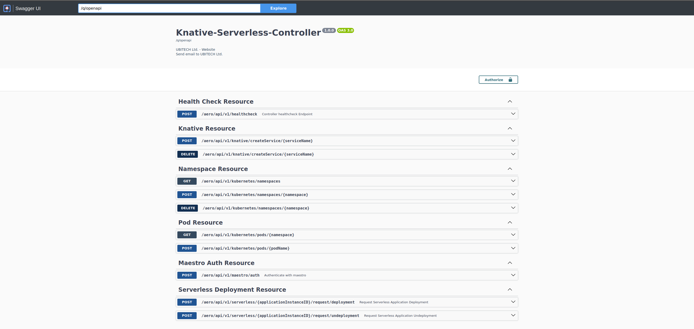

# Knative-Serverless-Controller

A Quarkus Microservice to handle Serverless Knative Deployments 

[](https://opensource.org/licenses/Apache-2.0)

The aim of this project is to develop an autonomous Controller Microservice that provides the essential tools and operations for handling Knative Serverless Deployments

### Functionalities

The microservice exposes a set of REST API endpoints responsible for handling:

1. Serverless Deployments (Request Deployment, Request Undeployment)

2. Maestro Authentication (Generate access token)

3. Namespaces in K8s cluster (Get, Create, Delete)

4. Pods in K8s cluster (Get, Create, Delete)

5. Controller Health Check (Post request)

6. Knative Dummy/Test Service (Create, Delete)


The microservice communicates with MAESTRO to execute the requests.

### API Documentation

The exposed rest services are documented using the **OpenAPI v3.0.3** specification and **Swagger UI**. The project ships with a Documentation UI page under http://PROJECT_IP:PROJECT_PORT/q/swagger-ui, where PROJECT_IP and PROJECT_PORT correspond to the parameters used to run the microservice (e.g. http://localhost:9500/q/swagger-ui)



<br/>


## **Project Setup and Usage**

This project is built using **[Quarkus](https://quarkus.io/) Java Framework v3.11.1**. In order to run the application in development mode you will need **Java v17**, and **Maven version 3.9.6** or higher. Optionally, to produce native executable version you will need **GraalVM v22.2.0 or higher**.

You can set project parameters in **src/main/resources/application.yaml** file:

- *quarkus.http.port* sets the port in which the microservice
- *quarkus.rest-client.maestro-rest-api.url* is the url in which the MAESTRO backend is running
- *quarkus.oidc.credentials.secret* the client secret of the backend client in keycloak (the service currently runs with no keyclok auth)


### Running the application in dev mode

You can start the application in dev mode using:
```shell script
./mvnw compile quarkus:dev
```

### Packaging and running the application

The application can be packaged using:
```shell script
./mvnw package
```
It produces the `quarkus-run.jar` file in the `target/quarkus-app/` directory.
Be aware that it’s not an _über-jar_ as the dependencies are copied into the `target/quarkus-app/lib/` directory.

The application is now runnable using `java -jar target/quarkus-app/quarkus-run.jar`.

If you want to build an _über-jar_, execute the following command:
```shell script
./mvnw package -Dquarkus.package.type=uber-jar
```

The application, packaged as an _über-jar_, is now runnable using `java -jar target/*-runner.jar`.

### Creating a native executable

You can create a native executable using:
```shell script
./mvnw package -Pnative
```

Or, if you don't have GraalVM installed, you can run the native executable build in a container using:
```shell script
./mvnw package -Pnative -Dquarkus.native.container-build=true
```

You can then execute your native executable with: `./target/knative-serverless-controller-{version}-runner`

To learn more about building native executable see https://quarkus.io/guides/maven-tooling.

### Containerized version

There are two docker-compose files:

- *docker-compose.yml* which will use the dev profile properties of the project
- *docker-compose.prod.yml* which can be used along with .env file (as one in .env.example) to set specifically the parametres of the project.

You can start the dockerized version using:  
```
#Dev version
docker compose up -d 

#Production version
docker compose -f docker-compose.prod.yml
```
