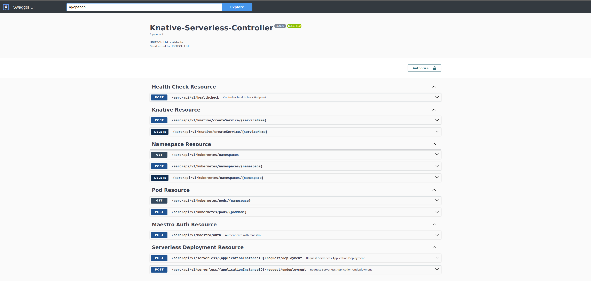

# knative-serverless-controller

> A Quarkus microservice that manages MAESTRO's serverless Knative deployments.

[](https://opensource.org/licenses/Apache-2.0)

This project provides an autonomous controller microservice exposing the essential
tools and operations for handling MAESTRO's Knative serverless deployments. It
communicates with MAESTRO to execute incoming requests.

## Table of Contents

- [Features](#features)
- [API Documentation](#api-documentation)
- [Prerequisites](#prerequisites)
- [Configuration](#configuration)
- [Running the Application](#running-the-application)
    - [Dev mode](#dev-mode)
    - [Packaging and running](#packaging-and-running)
    - [Native executable](#native-executable)
    - [Containerized version](#containerized-version)
- [License](#license)
- [Acknowledgement](#acknowledgement)

## Features

The microservice exposes a set of REST API endpoints responsible for handling:

1. **Serverless deployments** (deployment and undeployment requests)
2. **MAESTRO authentication** (access-token generation)
3. **Namespaces** in the K8s cluster (fetch, create, delete)
4. **Pods** in the K8s cluster (fetch, create, delete)
5. **Health check** for the controller
6. **Knative dummy service** (create, delete)

## API Documentation

The REST services are documented using the **OpenAPI v3.0.3** specification and
served through **Swagger UI**. Once the microservice is running, the documentation
is available at:

```
http://PROJECT_IP:PROJECT_PORT/q/swagger-ui
```

where `PROJECT_IP` and `PROJECT_PORT` correspond to the parameters used to run the
microservice — for example: <http://localhost:9500/q/swagger-ui>.



## Prerequisites

To build and run the application you will need:

| Tool                | Version           | Notes                                                                |
| ------------------- | ----------------- |----------------------------------------------------------------------|
| **Java**            | 17                | Required for dev/JVM mode.                                           |
| **Maven**           | 3.9.6 or higher   | Optional, the bundled Maven Wrapper (`./mvnw`) handles this for you. |
| **GraalVM**         | for JDK 17        | Optional, only needed to build a native executable locally.          |
| **Docker**          | —                 | Optional, only needed for the containerized version.                 |

Reference JDK used during development:

```text
$ java --version

openjdk 17.0.9 2023-10-17
OpenJDK Runtime Environment GraalVM CE 17.0.9+9.1 (build 17.0.9+9-jvmci-23.0-b22)
OpenJDK 64-Bit Server VM GraalVM CE 17.0.9+9.1 (build 17.0.9+9-jvmci-23.0-b22, mixed mode, sharing)
```

#### MAESTRO backend

The controller requires communication with MAESTRO. You can
run MAESTRO locally or point to a remote instance — either way, set the MAESTRO
backend URL in the configuration (see [Configuration](#configuration)).

#### Kubernetes & Knative

This controller manages Knative Serving deployments, so
it needs access to a Kubernetes cluster with Knative Serving installed.
<!-- TODO: document the required cluster version, Knative Serving version, how the
controller authenticates to the cluster (kubeconfig / in-cluster service account),
and the RBAC permissions it needs (namespaces, pods, Knative services). -->

## Configuration

Project parameters are set in **`src/main/resources/application.yaml`**:

| Property                                        | Description                                                                                                   |
| ----------------------------------------------- | ------------------------------------------------------------------------------------------------------------- |
| `quarkus.http.port`                             | Port on which the microservice listens.                                                                       |
| `quarkus.rest-client.maestro-rest-api.url`      | Base URL of the MAESTRO backend.                                                                              |
| `quarkus.oidc.credentials.secret`               | Client secret of the backend client in Keycloak. **Note:** the service currently runs without Keycloak auth. |

For the containerized production profile, these values are supplied through a
`.env` file — see [`.env.example`](.env.example) for the expected keys.

## Running the Application

This project is built with the **[Quarkus](https://quarkus.io/)** framework.
<!-- TODO: confirm the exact Quarkus version from pom.xml (the previous README
listed v3.37.2, which looks unusual for the 3.x line). -->

### Dev mode

Start the application in live-reload dev mode:

```bash
./mvnw compile quarkus:dev
```

### Packaging and running

Package the application:

```bash
./mvnw package
```

This produces `quarkus-run.jar` in `target/quarkus-app/`. Note that this is **not**
an _über-jar_ — dependencies are copied into `target/quarkus-app/lib/`. Run it with:

```bash
java -jar target/quarkus-app/quarkus-run.jar
```

To build an _über-jar_ instead:

```bash
./mvnw package -Dquarkus.package.type=uber-jar
```

The _über-jar_ is then runnable with:

```bash
java -jar target/*-runner.jar
```

### Native executable

Build a native executable (requires GraalVM):

```bash
./mvnw package -Pnative
```

If you don't have GraalVM installed, build it inside a container:

```bash
./mvnw package -Pnative -Dquarkus.native.container-build=true
```

Then run it:

```bash
./target/knative-serverless-controller-{version}-runner
```

For more on native builds, see the [Quarkus Maven tooling guide](https://quarkus.io/guides/maven-tooling).

### Containerized version

Two Compose files are provided:

- **`docker-compose.yml`** — uses the project's dev-profile properties.
- **`docker-compose.prod.yml`** — used together with a `.env` file (see `.env.example`)
  to configure the project's parameters explicitly.

Start the containerized version:

```bash
# Dev version
docker compose up -d

# Production version
docker compose -f docker-compose.prod.yml up -d
```

## License

This project is licensed under the **Apache License 2.0** — see the
[LICENSE](LICENSE) file for details.

## Acknowledgement

This work has been funded by the European Union under Horizon Europe grant 101092850
(project AERO).